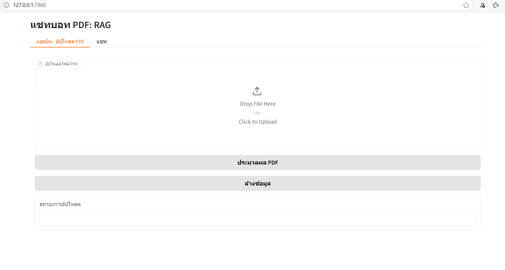
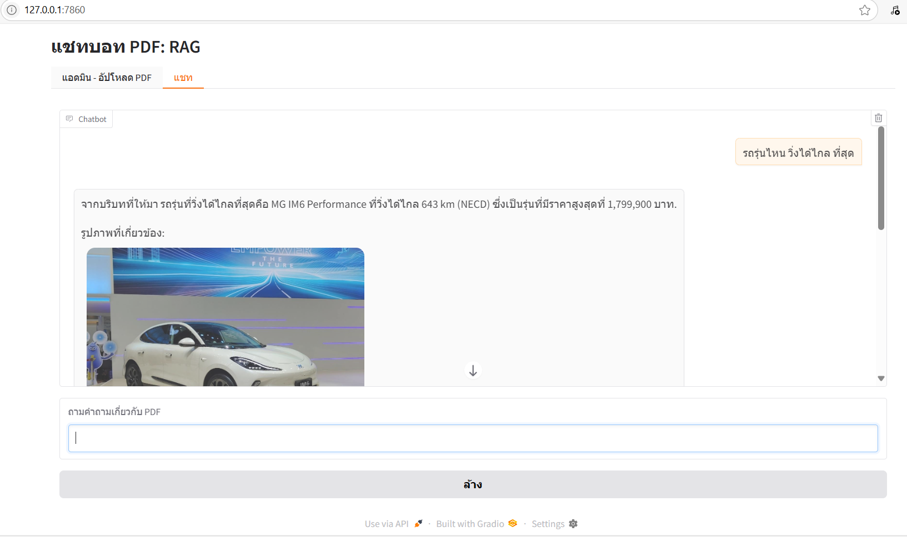

## PDF RAG ##

    Project นี้สำหรับการ ศึกษา RAG ด้วยไฟล์ knowledg base จาก PDF
    เพื่อเรียนรู้ จาก ช่อง T-LIVE-CODE   ต่อเนื่องจากการเรียนรู้เรื่อง RAG ด้วย Text
    ใน project นี้ยังไม่ได้ ทำ multimodal  RAG  แต่เป็นการทำ RAG จาก PDF

## โครงสร้าง ของ Project ##

    rag_pdf.py          # โปรแกรม 
    requirements.txt    # requirement file

## สิ่งที่ต้องเตรียม
    1. ติดตั้ง ollama
    - pull ollama image
      > ollama pull qwen2.5vl:3b
      > ollama pull gemma3:4b

    2. ติดตั้ง python

## โมเดล ที่ใช้
    - openai/clip-vit-base-patch32  สำหรับทำ text embedding, image embeding
    - qwen2.5vl:3b  เป็น chat model ที่รองรับ vision

## Library ที่ใช้งาน
    - PyMuPDF สำหรับ ประมวลผล PDF
    - CLIP (openai/clip-vit-base-patch32) สำหรับ embedding รูปภาพ
    - Chroma สำหรับเก็บข้อมูล
    - Ollama (qwen2.5vl:3b) สำหรับสร้างคำตอบ

## วิธีการ Run
    > git clone https://github.com/narongskml/rag_pdf.git
    > cd rag_pdf
    > python -m venv .venv
    > .venv\Script\activate
    > pip install torch torchvision torchaudio --index-url https://download.pytorch.org/whl/cu118
    > pip install -r requirements.txt
    > python rag_pdf.py

    เปิด browser  ไปที่ http://127.0.0.1:7860

## Screen Shot

